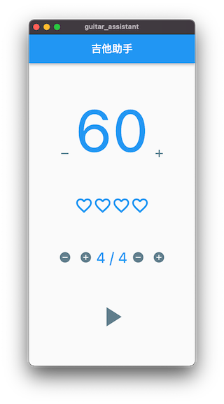
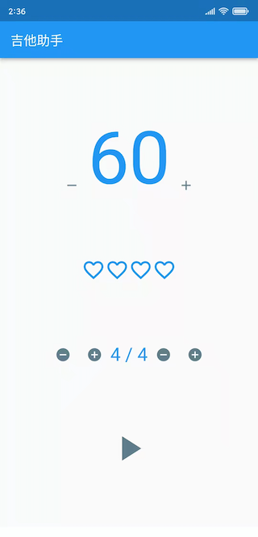

# GuitarAssistant

Guitar Assistant / 吉他助手

作为一个 Flutter 入门练手应用，顺便解决找不到干净好用的节拍器的问题。

前期主要关注 macOS 和 Android 平台。

## 功能特性

- [ ] 节拍器（WIP）
  - [x] BPM 简易展示和调整
  - [x] 拍号展示和调整
  - [x] 当前拍展示
  - [ ] 记住设置
  - [ ] 支持更多音效
  - [ ] 滑动调节 BPM
- [ ] 调音器（TODO）

## 运行效果

### macOS

### Android

## 已知问题

- [ ] BPM 高了以后，节奏不稳，有的拍子听不到声

## 参考

- <https://github.com/Tyrone2333/metronomelutter>